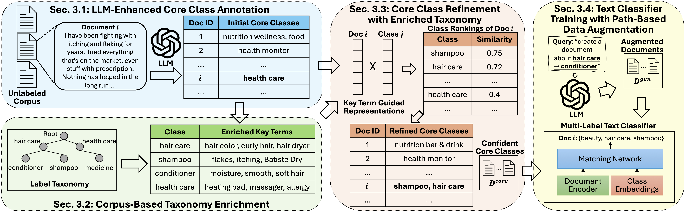

# TELEClass
The source code and data used for paper [TELEClass: Taxonomy Enrichment and LLM-Enhanced Hierarchical Text Classification with Minimal Supervision](https://arxiv.org/abs/2403.00165), published in WWW 2025.

## Overview
**TELEClass** is a weakly-supervied hierarchical text classification method empowered by large language models (LLM). TELEClass combines the general knowledge of LLMs and task-specific features mined from an unlabeled corpus. Specifically, TELEClass automatically enriches the raw taxonomy with class-indicative features for better label space understanding and utilizes novel LLM-based data annotation and generation methods tailored for the hierarchical setting. Experiments show that TELEClass can significantly outperform previous strong baselines while also achieving comparable performance to zero-shot prompting of LLMs with drastically less inference cost.

Please refer to our paper for more details ([paper](https://arxiv.org/abs/2403.00165)).

</img>

## Dataset
We use two datasets, Amazon-531 and DBPedia-298, and both datasets are in the ```./data``` folder (please unzip the DBPedia corpus files first). We include the original data and all intermediate results. Notice that we also include the training labels as they are available in the original datasets, but our method does not use them to train the final text classifier.

### Run on your own data
You need to provide a label taxonomy (see examples at ```./data/Amazon-531/label_hierarchy.txt``` and ```./data/Amazon-531/labels.txt```) and a training corpus (see ```./data/Amazon-531/train/corpus.txt```). You will also need to run [AutoPhrase](https://github.com/shangjingbo1226/AutoPhrase) or other similar phrase mining tools to get quality phrases and phrasal segemented corpus for taxonomy enrichment (see examples at ```./data/Amazon-531/train/autophrase_results.txt``` and ```./data/Amazon-531/train/phrasal_corpus.txt```).


## Run TELEClass
We provide a script to run the entire framework. You can also run any individual component because we provide all intermediate results in the data folder. Essentially, if you do not want to re-run LLM queries to save cost, you can reuse our results. More details in the script ```./run.sh```.

To run TELEClass on provided datasets, simply change the dataset name in the script and run the following command:
```
./run.sh
```

## Citations

If you find our work useful for your research, please cite the following paper:
```
@inproceedings{zhang2025teleclass,
    title={{TELEC}lass: Taxonomy Enrichment and LLM-Enhanced Hierarchical Text Classification with Minimal Supervision}, 
    author={Yunyi Zhang and Ruozhen Yang and Xueqiang Xu and Rui Li and Jinfeng Xiao and Jiaming Shen and Jiawei Han},
    year={2025},
    booktitle={WWW}
}
```